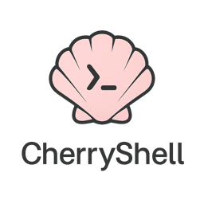
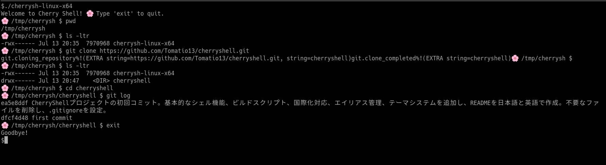

<h1 align="center">🌸 Cherry Shell - Beautiful & Simple Shell 🌸</h1>

<p align="center">
    
    
    
</p>

<p align="center">
    <a href="README.md"></a>
    <a href="README_ja.md"></a>
</p>

<p align="center">
    
</p>

<p align="center">
Cherry Shell is a beautiful and simple shell named after the cherry blossom shell (Sakura-gai).<br>
Small but beautiful, it provides an elegant command-line experience.
</p>

## ✨ Features
<p align="center">
    
</p>

- **🌸 Beautiful Design**: Elegant prompt with cherry blossom theme
- **🌍 Cross-platform**: Works on Windows, macOS, and Linux
- **⚡ Built-in Commands**: Essential commands like `ls`, `cat`, `cp`, `mv`, etc.
- **🔧 Git Integration**: Built-in git commands for version control
- **🎨 Theme Support**: Multiple themes to customize your shell appearance
- **🔗 Alias Support**: Create custom command shortcuts
- **🌐 Internationalization**: Supports English and Japanese languages

## 📦 Installation

### From Source

```bash
git clone https://github.com/your-username/cherryshell.git
cd cherryshell
go build -o cherrysh main.go
```

### Binary Release

Download the latest binary from the releases page.

## 🚀 Usage

### Basic Commands

```bash
# Start Cherry Shell
./cherrysh

# Basic file operations
ls                    # List directory contents
cat file.txt         # Display file contents
cp source dest       # Copy files
mv source dest       # Move files
rm file.txt          # Delete files
mkdir dirname        # Create directory
cd dirname           # Change directory
pwd                  # Print working directory

# Git commands
git status           # Show git status
git add file.txt     # Add file to staging
git commit -m "msg"  # Commit changes
git push             # Push to remote
git pull             # Pull from remote
git log              # Show commit history
git clone <URL>      # Clone repository

# Theme management
theme                # List available themes
theme <name>         # Set theme

# Alias management
alias                # List aliases
alias ll='ls -la'    # Create alias
```

## 🌐 Language Support

Cherry Shell supports multiple languages. You can set the language using:

### Command Line Option
```bash
./cherrysh --lang en    # English
./cherrysh --lang ja    # Japanese
```

### Environment Variable
```bash
export CHERRYSH_LANG=en    # English
export CHERRYSH_LANG=ja    # Japanese
./cherrysh
```

### System Locale
Cherry Shell automatically detects your system locale. If `LANG` environment variable is set to `ja_JP.UTF-8` or similar, it will use Japanese.

## ⚙️ Configuration

Cherry Shell uses a configuration file located at `~/.cherryshrc`:

```bash
# Theme setting
theme default

# Language setting
LANG="en"

# Aliases
alias ll="ls -la"
alias la="ls -la"
alias l="ls -l"
alias grep="grep --color=auto"
alias ..="cd .."
alias ...="cd ../.."

# GitHub Authentication Settings
GITHUB_TOKEN="ghp_your_token_here"
GITHUB_USER="your_username"
```

> 💡 **Tip**: You can customize your settings by referring to the `.cherryshrc.example` file.

## 🎨 Available Themes

- **default**: Cherry blossom theme with elegant prompt
- **minimal**: Clean and minimal design
- **robbyrussell**: Oh-my-zsh robbyrussell style
- **agnoster**: Powerline-style theme
- **pure**: Pure and simple theme

## 🌍 Supported Languages

- **🇺🇸 English (en)**: Full support
- **🇯🇵 Japanese (ja)**: Full support

## 🛠️ Development

### Building

```bash
# Build for current platform
go build -o cherrysh main.go

# Build for all platforms
./build.sh

# Run tests
go test ./...
```

### Adding New Languages

1. Create a new message file in `i18n/messages/<lang>.json`
2. Translate all message keys
3. Add the language code to `GetAvailableLanguages()` in `i18n/i18n.go`
4. Update the language detection logic if needed

### 📁 Project Structure

```
cherryshell/
├── main.go              # Entry point
├── i18n/                # Internationalization
│   ├── i18n.go         # i18n management
│   └── messages/        # Translation files
│       ├── en.json     # English messages
│       └── ja.json     # Japanese messages
├── shell/               # Shell implementation
│   ├── shell.go        # Main shell logic
│   ├── command.go      # Command handling
│   ├── git.go          # Git integration
│   ├── prompt.go       # Prompt generation
│   └── windows.go      # Windows-specific commands
├── config/              # Configuration
│   ├── config.go       # Config management
│   └── alias.go        # Alias handling
└── themes/              # Theme system
    └── theme.go        # Theme definitions
```

## 🤝 Contributing

1. Fork the repository
2. Create a feature branch
3. Make your changes
4. Add tests if applicable
5. Submit a pull request

## 📄 License

This project is licensed under the MIT License.

## 🙏 Acknowledgments

- Named after the cherry blossom shell (Sakura-gai)
- Inspired by the beauty of simplicity
- Built with Go for cross-platform compatibility

---

<p align="center">
🌸 <strong>Cherry Shell</strong> - Small but beautiful, just like the cherry blossom shell.
</p> 