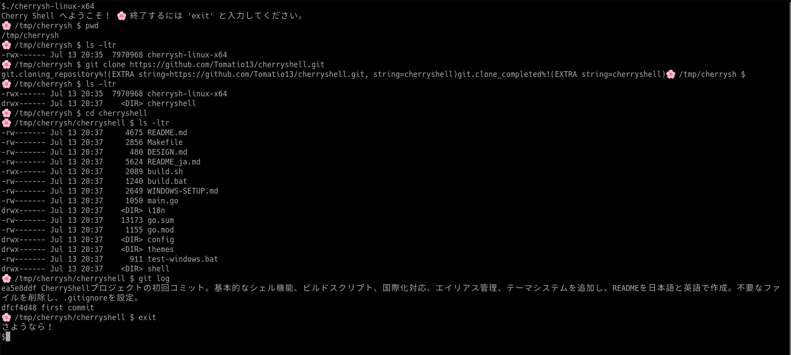

<h1 align="center">🌸 Cherry Shell - 美しくシンプルなシェル 🌸</h1>

<p align="center">
    
    
    
</p>

<p align="center">
    <a href="README.md"></a>
    <a href="README_ja.md"></a>
</p>

<p align="center">
    
</p>

<p align="center">
Cherry Shell は桜貝（Sakura-gai）にちなんで名付けられた美しくシンプルなシェルです。<br>
小さくても美しく、エレガントなコマンドライン体験を提供します。
</p>

## ✨ 機能

<p align="center">
    
</p>

- **🌸 美しいデザイン**: 桜のテーマを使用したエレガントなプロンプト
- **🌍 クロスプラットフォーム**: Windows、macOS、Linuxで動作
- **⚡ 組み込みコマンド**: `ls`、`cat`、`cp`、`mv`などの必須コマンド
- **🔧 Git統合**: バージョン管理のための組み込みgitコマンド
- **🎨 テーマサポート**: シェルの外観をカスタマイズする複数のテーマ
- **🔗 エイリアスサポート**: カスタムコマンドショートカットの作成
- **🌐 国際化**: 英語と日本語をサポート

## 📦 インストール

### 🚀 バイナリダウンロード

最新のリリース版をダウンロード：

[](https://github.com/your-username/cherryshell/releases/latest)

> **📥 [リリースページ](https://github.com/your-username/cherryshell/releases)** から最新版をダウンロードしてください

### 🛠️ ソースからビルド

```bash
git clone https://github.com/your-username/cherryshell.git
cd cherryshell
go build -o cherrysh main.go
```

## 🚀 使用方法

### 基本コマンド

```bash
# Cherry Shell を起動
./cherrysh

# 基本的なファイル操作
ls                    # ディレクトリ内容を表示
cat file.txt         # ファイル内容を表示
cp source dest       # ファイルをコピー
mv source dest       # ファイルを移動
rm file.txt          # ファイルを削除
mkdir dirname        # ディレクトリを作成
cd dirname           # ディレクトリを変更
pwd                  # 現在のディレクトリを表示

# Git コマンド
git status           # git ステータスを表示
git add file.txt     # ファイルをステージングに追加
git commit -m "msg"  # 変更をコミット
git push             # リモートにプッシュ
git pull             # リモートからプル
git log              # コミット履歴を表示
git clone <URL>      # リポジトリをクローン

# テーマ管理
theme                # 利用可能なテーマを表示
theme <name>         # テーマを設定

# エイリアス管理
alias                # エイリアスを表示
alias ll='ls -la'    # エイリアスを作成
```

## 🌐 言語サポート

Cherry Shell は複数の言語をサポートしています。以下の方法で言語を設定できます：

### コマンドラインオプション
```bash
./cherrysh --lang en    # 英語
./cherrysh --lang ja    # 日本語
```

### 環境変数
```bash
export CHERRYSH_LANG=en    # 英語
export CHERRYSH_LANG=ja    # 日本語
./cherrysh
```

### システムロケール
Cherry Shell は自動的にシステムロケールを検出します。`LANG` 環境変数が `ja_JP.UTF-8` などに設定されている場合、日本語を使用します。

## ⚙️ 設定

Cherry Shell は `~/.cherryshrc` にある設定ファイルを使用します：

```bash
# テーマ設定
theme default

# 言語設定
LANG="ja"

# エイリアス
alias ll="ls -la"
alias la="ls -la"
alias l="ls -l"
alias grep="grep --color=auto"
alias ..="cd .."
alias ...="cd ../.."

# GitHub認証設定 
GITHUB_TOKEN="ghp_your_token_here"
GITHUB_USER="your_username"
```

> 💡 **ヒント**: `.cherryshrc.example` ファイルを参考にして設定をカスタマイズできます。

## 🎨 利用可能なテーマ

- **default**: エレガントなプロンプトを持つ桜のテーマ
- **minimal**: クリーンでミニマルなデザイン
- **robbyrussell**: Oh-my-zsh robbyrussell スタイル
- **agnoster**: Powerline スタイルのテーマ
- **pure**: ピュアでシンプルなテーマ

## 🌍 サポートされている言語

- **🇺🇸 English (en)**: 完全サポート
- **🇯🇵 日本語 (ja)**: 完全サポート

## 🛠️ 開発

### ビルド

```bash
# 現在のプラットフォーム用にビルド
go build -o cherrysh main.go

# 全プラットフォーム用にビルド
./build.sh

# テストを実行
go test ./...
```

### 新しい言語の追加

1. `i18n/messages/<lang>.json` に新しいメッセージファイルを作成
2. すべてのメッセージキーを翻訳
3. `i18n/i18n.go` の `GetAvailableLanguages()` に言語コードを追加
4. 必要に応じて言語検出ロジックを更新

### 📁 プロジェクト構造

```
cherryshell/
├── main.go              # エントリーポイント
├── i18n/                # 国際化
│   ├── i18n.go         # i18n 管理
│   └── messages/        # 翻訳ファイル
│       ├── en.json     # 英語メッセージ
│       └── ja.json     # 日本語メッセージ
├── shell/               # シェル実装
│   ├── shell.go        # メインシェルロジック
│   ├── command.go      # コマンド処理
│   ├── git.go          # Git統合
│   ├── prompt.go       # プロンプト生成
│   └── windows.go      # Windows固有コマンド
├── config/              # 設定
│   ├── config.go       # 設定管理
│   └── alias.go        # エイリアス処理
└── themes/              # テーマシステム
    └── theme.go        # テーマ定義
```

## 🤝 貢献

1. リポジトリをフォーク
2. 機能ブランチを作成
3. 変更を加える
4. 該当する場合はテストを追加
5. プルリクエストを送信

## 📄 ライセンス

このプロジェクトはMITライセンスの下でライセンスされています。

## 🙏 謝辞

- 桜貝（Sakura-gai）にちなんで名付けられました
- シンプルさの美しさにインスパイアされました
- クロスプラットフォーム互換性のためにGoで構築されました

---

<p align="center">
🌸 <strong>Cherry Shell</strong> - 桜貝のように小さくても美しい。
</p>

## GitHub認証設定

プライベートリポジトリのクローンやプッシュを行うには、GitHubパーソナルアクセストークンを設定する必要があります。

### 1. GitHubパーソナルアクセストークンの取得

1. GitHubにログインし、[Settings > Developer settings > Personal access tokens](https://github.com/settings/tokens)に移動
2. "Generate new token (classic)"をクリック
3. 適切なスコープを選択（リポジトリアクセスには`repo`スコープが必要）
4. トークンをコピー

### 2. .cherryshrcファイルの設定

```bash
# GitHub認証設定
GITHUB_TOKEN="ghp_your_token_here"
GITHUB_USER="your_username"
```

### 3. 設定の確認

```bash
config show
```

### 4. プライベートリポジトリのクローン

```bash
git clone https://github.com/username/private-repo.git
```

これで認証が必要なリポジトリも正常にクローンできるようになります。 